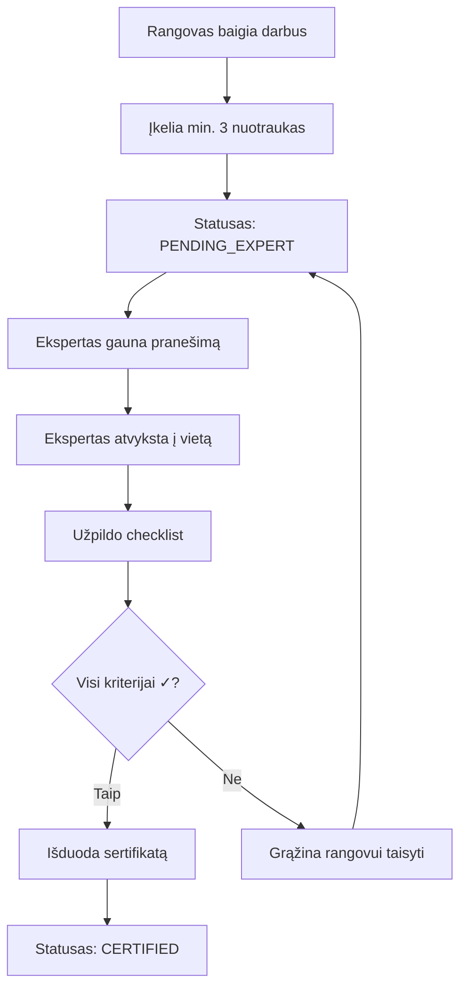

# 🏆 VEJAPRO KONSTITUCIJA V.1.3 (2026 m. Redakcija)

## 📋 TURINYS

0. [Korekcijos ir Suderinimai](#0-korekcijos-ir-suderinimai-2026-02-03)
1. [Sistemos Stuburas](#1-sistemos-stuburas-core-domain)
2. [Projektų Statusų Ciklas](#2-projektų-statusų-ciklas-forward-only)
3. [Etapiškumas ir Exit Criteria](#3-etapiškumas-ir-exit-criteria)
4. [AI Diegimo ir Teisinė Logika](#4-ai-diegimo-ir-teisinė-logika)
5. [Techninė Užduotis](#5-techninė-užduotis-api-endpoints)
6. [Eksperto Sertifikavimo Checklist](#6-eksperto-sertifikavimo-checklistas)
7. [Neužrašytos Taisyklės](#7-neužrašytos-bet-privalomos-taisyklės)
8. [Pagrindiniai Principai](#8-principai-kurių-niekada-nekeičiame)
---


## 0. KOREKCIJOS IR SUDERINIMAI (2026-02-03)

?i dalis yra kanonin? Core Domain specifikacija. Jei randamas konfliktas, galioja ?i dalis.

1. Statusai (vienintel? leid?iama aib?): DRAFT, PAID, SCHEDULED, PENDING_EXPERT, CERTIFIED, ACTIVE.
2. Statusas yra darbo eigos a?is. Mok?jimai ir aktyvacija valdomi per finansinius/aktyvacijos flag'us, ne per papildomus statusus.
3. Statusas kei?iamas tik per POST /api/v1/transition-status, forward-only. Kiekvienas per?jimas privalo sukurti audit log.
4. is_certified privalo atitikti status in (CERTIFIED, ACTIVE) (DB constraint arba triggeris).
5. Marketingo vie?inimas tik jei: marketing_consent = true, status >= CERTIFIED, veiksm? atlieka EXPERT arba ADMIN.
6. Per?jim? matrica: DRAFT->PAID, PAID->SCHEDULED, SCHEDULED->PENDING_EXPERT, PENDING_EXPERT->CERTIFIED, CERTIFIED->ACTIVE. Kiti per?jimai = 400.
7. Aktoriai: SYSTEM_STRIPE, SYSTEM_TWILIO, CLIENT, SUBCONTRACTOR, EXPERT, ADMIN. Leidimai:
   - DRAFT->PAID: tik SYSTEM_STRIPE
   - PAID->SCHEDULED: SUBCONTRACTOR arba ADMIN
   - SCHEDULED->PENDING_EXPERT: SUBCONTRACTOR arba ADMIN
   - PENDING_EXPERT->CERTIFIED: EXPERT arba ADMIN (>=3 EXPERT_CERTIFICATION + checklist)
   - CERTIFIED->ACTIVE: tik SYSTEM_TWILIO (final mok?jimas + teisingas SMS kodas)
8. Mok?jimai: deposit (payment_type=deposit) -> DRAFT->PAID. Final (payment_type=final) nekei?ia statuso, sukuria SMS patvirtinimo u?klaus?.
9. SMS formatas: TAIP <KODAS>, vienkartinis, su expires_at. Laisvas "TAIP" be kodo draud?iamas.
10. Kanoniniai endpointai (/api/v1): /projects, /projects/{id}, /transition-status, /upload-evidence, /certify-project, /webhook/stripe, /webhook/twilio, /projects/{id}/marketing-consent, /evidences/{id}/approve-for-web, /gallery.
11. Audit log formatas: entity_type, entity_id, action, old_value (JSONB), new_value (JSONB), actor_type, actor_id, ip_address (INET), user_agent, metadata, timestamp.
12. Marketing consent neprivalomas mok?jimui; at?aukus sutikim? -> show_on_web=false visoms projekto nuotraukoms + audit log.
13. Idempotencija: visi webhook'ai pagal event_id, transition-status idempotenti?kas kai new_status == current_status, SMS vienkartinis su bandym? limitu.

---
## 1. SISTEMOS STUBURAS (CORE DOMAIN)

### 1.1 Vienos Tiesos Šaltinis
**Principas:** Visa verslo logika, kainodara ir statusų kontrolė gyvena **tik FastAPI Backend'e**.

- ✅ Visi skaičiavimai atliekami serveryje
- ✅ Validacija vykdoma Backend'e
- ✅ Statusų perėjimai kontroliuojami API lygmenyje
- ❌ Frontend'as negali keisti kainos ar statuso

### 1.2 Klientų Architektūra
Visi klientai yra **tik duomenų vartotojai**:

| Modulis | Paskirtis | Logikos Lygis |
|---------|-----------|---------------|
| **M1** (Web) | Kliento sąsaja | Tik UI/UX |
| **M2** (Eksperto/Rangovo App) | Mobili aplikacija | Tik duomenų rodymas |
| **M3** (AI Logic) | Dirbtinis intelektas | Siūlymai, ne sprendimai |

**Kritinė taisyklė:** Jokios verslo logikos Frontend'e!

### 1.3 Versijavimas
- Visi Core Domain pakeitimai atliekami **tik per backend migracijas**
- Kiekviena migracija turi būti versijuota (pvz., `V001_initial_schema.sql`)
- Rollback galimybė privaloma
- Audit log visoms struktūriniams pakeitimams

---

## 2. PROJEKTŲ STATUSŲ CIKLAS (FORWARD-ONLY)

### 2.1 Statusų Diagrama

```
DRAFT → PAID (DEPOSIT) → SCHEDULED → PENDING_EXPERT → CERTIFIED → ACTIVE
  ↓         ↓                ↓              ↓              ↓            ↓
[Analizė] [Depozitas]   [Rangovas]    [Darbai baigti] [Ekspertas] [SMS ✓]
```

### 2.2 Statusų Aprašymai

#### 🔵 DRAFT
- **Aprašymas:** Pradinė užklausa
- **Veiksmai:** Analizė, sąmatos kūrimas
- **Išėjimo sąlyga:** Klientas patvirtina sąmatą
- **Dokumentai:** Preliminari sąmata

#### 💰 PAID (DEPOSIT)
- **Aprašymas:** Sumokėtas depozitas
- **Veiksmai:** Generuojama sutartis
- **Išėjimo sąlyga:** Stripe webhook patvirtinimas
- **Dokumentai:** Avanso sąskaita faktūra, sutartis

#### 📅 SCHEDULED
- **Aprašymas:** Rangovas patvirtintas
- **Veiksmai:** Generuojama rangos sutartis
- **Išėjimo sąlyga:** Rangovas priima užsakymą
- **Dokumentai:** Rangos sutartis, darbo grafikas

#### ⏳ PENDING_EXPERT
- **Aprašymas:** Rangovas baigė darbus
- **Veiksmai:** Reikalingas eksperto vizitas
- **Išėjimo sąlyga:** Min. 3 nuotraukos įkeltos
- **Dokumentai:** Darbų baigimo aktas (preliminarus)

#### ✅ CERTIFIED
- **Aprašymas:** Ekspertas patvirtino kokybę
- **Veiksmai:** Veto teisė įgyvendinta
- **Išėjimo sąlyga:** SMS patvirtinimas iš kliento
- **Dokumentai:** Sertifikatas (negrįžtamas)

#### 🎯 ACTIVE
- **Aprašymas:** Klientas patvirtino SMS žinute
- **Veiksmai:** Aktyvuota abonementinė priežiūra
- **Išėjimo sąlyga:** N/A (galutinis statusas)
- **Dokumentai:** Galutinė sąskaita, garantinis lapas

### 2.3 Saugikliai

#### SMS Patvirtinimo Saugiklis
```python
# CERTIFIED -> ACTIVE pereinama TIK per kliento SMS su tokenu
# Pvz: "TAIP VP-2026-AB12CD34"

def validate_sms_confirmation(project_id: str, sms_body: str) -> bool:
    token = extract_token(sms_body)
    if not token:
        raise ValidationError("Tr?ksta patvirtinimo kodo")

    confirmation = get_sms_confirmation(token)
    if not confirmation or confirmation.project_id != project_id:
        raise ValidationError("Netinkamas patvirtinimo kodas")

    if confirmation.is_expired:
        raise ValidationError("Patvirtinimo kodas nebegalioja")

    project = get_project(project_id)
    if project.status != ProjectStatus.CERTIFIED:
        raise ValidationError("Projektas dar nesertifikuotas")

    return True

```

#### Vienkrypčio Perėjimo Saugiklis
```python
STATUS_TRANSITIONS = {
    "DRAFT": ["PAID"],
    "PAID": ["SCHEDULED"],
    "SCHEDULED": ["PENDING_EXPERT"],
    "PENDING_EXPERT": ["CERTIFIED"],
    "CERTIFIED": ["ACTIVE"],
    "ACTIVE": []  # Galutinis statusas
}

def can_transition(from_status: str, to_status: str) -> bool:
    allowed = STATUS_TRANSITIONS.get(from_status, [])
    return to_status in allowed
```

---

## 3. ETAPIŠKUMAS IR EXIT CRITERIA

### 3.1 I Etapas: Core MVP
**Tikslas:** Pajamos iš įrengimo

#### Exit Criteria
- ✅ ≥80% užsakymų pereina DRAFT → PAID be klaidų
- ✅ Stripe integracija veikia 99.9% uptime
- ✅ Sutarčių generavimas automatizuotas
- ✅ Audit log visoms transakcijoms

#### Metrikos
```python
mvp_success_rate = (
    successful_transitions / total_transitions
) * 100

# Tikslas: mvp_success_rate >= 80%
```

### 3.2 II Etapas: AI & Robots
**Tikslas:** Mastelis

#### Aktyvavimo Sąlyga
- 30 dienų stabilumo Lygmenyje 1
- Feature Flags: `ENABLE_VISION = true`
- Zero critical bugs per savaitę

#### Funkcionalumas
- AI vizualinė analizė (sklypo nuotraukos)
- Robotų bazių planavimas
- Automatinis sąmatų generavimas

### 3.3 III Etapas: Recurring Revenue
**Tikslas:** Pelnas

#### Aktyvavimo Sąlyga
- Aktyvuojama **tik sertifikuotiems** projektams
- `is_certified = true` DB laukas
- Min. 50 aktyvių abonentų

#### Pajamų Modelis
- Mėnesinis abonementas: €29.99/mėn
- Garantinis servisas: 2 vizitai/sezonas
- Papildomos paslaugos: pagal poreikį

---

## 4. AI DIEGIMO IR TEISINĖ LOGIKA

### 4.1 AI Rolė Sistemoje

**Pagrindinis Principas:** AI **tik siūlo** duomenis, niekada nekeičia projekto statuso.

#### Leistini AI Veiksmai
- ✅ Sklypo ploto skaičiavimas iš nuotraukų
- ✅ Kliūčių aptikimas
- ✅ Sąmatos generavimas (draft)
- ✅ Roboto bazės vietos siūlymas

#### Draudžiami AI Veiksmai
- ❌ Statuso keitimas
- ❌ Kainos patvirtinimas
- ❌ Sutarties pasirašymas
- ❌ Sertifikato išdavimas

### 4.2 Audit Trail

Visi AI sugeneruoti laukai turi žymą `generated_by_ai = true`:

```sql
CREATE TABLE project_estimates (
    id UUID PRIMARY KEY,
    project_id UUID REFERENCES projects(id),
    area_sqm DECIMAL(10,2),
    generated_by_ai BOOLEAN DEFAULT FALSE,
    ai_model_version VARCHAR(50),
    ai_confidence_score DECIMAL(3,2),
    verified_by_expert BOOLEAN DEFAULT FALSE,
    created_at TIMESTAMP DEFAULT NOW()
);
```

#### AI Audit Log Pavyzdys
```json
{
    "field": "area_sqm",
    "value": 450.5,
    "generated_by_ai": true,
    "ai_model": "gpt-4-vision-preview",
    "confidence": 0.92,
    "timestamp": "2026-02-02T21:04:00Z",
    "verified_by": null
}
```

### 4.3 Sertifikatas

**Kritinė Taisyklė:** Sertifikatas yra **negrįžtamas aktas**.

- Generuojamas **tik** CERTIFIED statuso metu
- Pasirašomas eksperto
- Turi unikalų numerį
- Saugomas PDF formatu su blockchain hash

```python
@dataclass
class Certificate:
    certificate_number: str  # Format: VEJA-2026-{project_id[:8]}
    project_id: str
    expert_id: str
    issue_date: datetime
    blockchain_hash: str
    pdf_url: str
    is_revocable: bool = False  # Visada False
```

---

## 5. TECHNINĖ UŽDUOTIS (API ENDPOINTS)

### 5.1 Statusų Valdymas

#### POST /api/v1/transition-status
**Aprašymas:** Vienintelis legalus kelias keisti statusus

**Request:**
```json
{
    "project_id": "uuid",
    "to_status": "PAID",
    "metadata": {
        "payment_intent_id": "pi_xxx",
        "amount": 500.00
    }
}
```

**Validacija:**
```python
from pydantic import BaseModel, validator

class StatusTransitionRequest(BaseModel):
    project_id: str
    to_status: ProjectStatus
    metadata: dict
    
    @validator('to_status')
    def validate_transition(cls, v, values):
        project = get_project(values['project_id'])
        if not can_transition(project.status, v):
            raise ValueError(
                f"Negalimas perėjimas: {project.status} → {v}"
            )
        return v
```

**Response:**
```json
{
    "success": true,
    "project_id": "uuid",
    "old_status": "DRAFT",
    "new_status": "PAID",
    "transition_id": "uuid",
    "timestamp": "2026-02-02T21:04:00Z"
}
```

### 5.2 Projekto Kūrimas

#### POST /api/v1/projects
**Aprašymas:** Sukuria pradinį DRAFT įrašą

**Request:**
```json
{
    "client_name": "Jonas Jonaitis",
    "client_email": "jonas@example.com",
    "client_phone": "+37060000000",
    "address": "Vilnius, Žirmūnų g. 1",
    "estimated_area": 500
}
```

**Response:**
```json
{
    "project_id": "uuid",
    "status": "DRAFT",
    "created_at": "2026-02-02T21:04:00Z",
    "next_steps": [
        "Įkelti sklypo nuotraukas",
        "Gauti AI sąmatą",
        "Patvirtinti sąmatą"
    ]
}
```

### 5.3 Projekto Informacija

#### GET /api/v1/projects/{id}
**Aprašymas:** Grąžina pilną būseną ir audit log istoriją

**Response:**
```json
{
    "project_id": "uuid",
    "status": "CERTIFIED",
    "client": {
        "name": "Jonas Jonaitis",
        "email": "jonas@example.com",
        "phone": "+37060000000"
    },
    "timeline": [
        {
            "status": "DRAFT",
            "timestamp": "2026-01-15T10:00:00Z",
            "actor": "system"
        },
        {
            "status": "PAID",
            "timestamp": "2026-01-16T14:30:00Z",
            "actor": "stripe_webhook",
            "metadata": {"amount": 500.00}
        }
    ],
    "documents": [
        {
            "type": "contract",
            "url": "https://...",
            "generated_at": "2026-01-16T14:31:00Z"
        }
    ],
    "audit_log": [...]
}
```

### 5.4 Įrodymų Įkėlimas

#### POST /api/v1/upload-evidence
**Aprašymas:** Foto/dokumentų įkėlimas

**Request (multipart/form-data):**
```
project_id: uuid
evidence_type: photo | document
file: [binary]
description: "Sklypo nuotrauka iš šiaurės pusės"
```

**Response:**
```json
{
    "evidence_id": "uuid",
    "project_id": "uuid",
    "file_url": "https://storage.../photo.jpg",
    "uploaded_at": "2026-02-02T21:04:00Z",
    "ai_analysis": {
        "detected_area": 450.5,
        "obstacles": ["tree", "fence"],
        "confidence": 0.92
    }
}
```

### 5.5 Sertifikavimas

#### POST /api/v1/certify-project
**Aprašymas:** Eksperto veiksmas

**Validacija:**
- ✅ Privaloma min. 3 nuotraukos
- ✅ Visi checklist punktai pažymėti
- ✅ Ekspertas turi galiojančią licenciją

**Request:**
```json
{
    "project_id": "uuid",
    "expert_id": "uuid",
    "checklist": {
        "ground_level": true,
        "seed_uniformity": true,
        "edge_treatment": true,
        "robot_base_stability": true,
        "perimeter_wire_integrity": true,
        "site_cleanliness": true
    },
    "photos": ["evidence_id_1", "evidence_id_2", "evidence_id_3"],
    "notes": "Darbai atlikti kokybiškai"
}
```

**Response:**
```json
{
    "certificate_number": "VEJA-2026-ABC12345",
    "project_id": "uuid",
    "status": "CERTIFIED",
    "certificate_url": "https://storage.../certificate.pdf",
    "blockchain_hash": "0x...",
    "next_action": "Laukiama kliento SMS patvirtinimo"
}
```

### 5.6 Stripe Webhook

#### POST /api/v1/webhook/stripe
**Aprašymas:** Galutinis atsiskaitymo trigger'is po sertifikavimo

**Request (from Stripe):**
```json
{
    "type": "payment_intent.succeeded",
    "data": {
        "object": {
            "id": "pi_xxx",
            "amount": 150000,
            "metadata": {
                "project_id": "uuid",
                "payment_type": "final"
            }
        }
    }
}
```

**Veiksmai:**
1. Validuoti Stripe signature
2. Patikrinti projekto statusą (turi būti CERTIFIED)
3. Siųsti SMS patvirtinimo užklausą klientui
4. Laukti "TAIP" atsakymo
5. Pereiti į ACTIVE statusą

---

## 6. EKSPERTO SERTIFIKAVIMO CHECKLIST'AS

### 6.1 Privalomi Foto Reikalavimai

**Minimumas:** 3–5 kontrolinės nuotraukos

| # | Nuotrauka | Aprašymas | Privaloma |
|---|-----------|-----------|-----------|
| 1 | Bendras vaizdas | Visas sklypas iš viršaus/šono | ✅ |
| 2 | Pagrindo lygumas | Artimesnis vaizdas žolės paviršiaus | ✅ |
| 3 | Kraštų apdirbimas | Perimetro zona | ✅ |
| 4 | Roboto bazė | Įrengta ir stabili | ⚠️ |
| 5 | Perimetro kabelis | Vientisumas, tvirtinimas | ⚠️ |

**Blokavimas:** Be min. 3 nuotraukų sertifikavimas **neįmanomas**.

### 6.2 Vertinimo Kriterijai

#### 🟢 Pagrindo Lygumas
- Nėra duobių > 2 cm gylio
- Nėra kauburių > 3 cm aukščio
- Nuolydis ≤ 25° (robotui saugus)

**Vertinimas:**
```python
def evaluate_ground_level(photos: List[Photo]) -> bool:
    ai_analysis = analyze_terrain(photos)
    return (
        ai_analysis.max_depression < 2.0 and
        ai_analysis.max_elevation < 3.0 and
        ai_analysis.max_slope <= 25.0
    )
```

#### 🟢 Sėjos Tolygumas
- Žolės tankumas ≥ 80% ploto
- Nėra plikų dėmių > 0.5 m²
- Vienoda augimo fazė

#### 🟢 Kraštų Apdirbimas
- Aiškiai apibrėžta riba
- Perimetro kabelis 5–10 cm nuo krašto
- Nėra pažeistų vietų

#### 🟢 Roboto Bazės Stabilumas
- Lygi platforma
- Elektros prijungimas saugus
- Apsauga nuo lietaus

#### 🟢 Perimetro Kabelio Vientisumas
- Nėra pertrūkių
- Tvirtinimas kas 75 cm
- Signalo stiprumas > 80%

#### 🟢 Sklypo Švara
- Pašalintos statybinės atliekos
- Nėra pavojingų objektų
- Estetiškas vaizdas

### 6.3 Sertifikavimo Procesas



---

## 7. NEUŽRAŠYTOS, BET PRIVALOMOS TAISYKLĖS

### 7.1 Maržų Neliečiamumas

**Principas:** Maržos keičiamos **tik per admin panelę** su Audit Log.

#### Draudžiama
- ❌ Tiesioginis DB pakeitimas (`UPDATE margins SET ...`)
- ❌ Maržų keitimas per API be autentifikacijos
- ❌ Frontend'e hardcoded maržos

#### Leidžiama
- ✅ Admin panelė su 2FA autentifikacija
- ✅ Audit log kiekvienam pakeitimui
- ✅ Versijuotos maržų lentelės

**Pavyzdys:**
```sql
CREATE TABLE margin_history (
    id UUID PRIMARY KEY,
    margin_type VARCHAR(50),
    old_value DECIMAL(5,2),
    new_value DECIMAL(5,2),
    actor_type VARCHAR(50) NOT NULL,
    actor_id UUID,
    timestamp TIMESTAMP DEFAULT NOW(),
    reason TEXT NOT NULL
);
```

### 7.2 Feature Flags

**Principas:** Lygio 2 ir 3 moduliai išjungti pagal nutylėjimą.

```python
# config.py
class FeatureFlags:
    ENABLE_VISION = os.getenv("ENABLE_VISION", "false").lower() == "true"
    ENABLE_RECURRING = os.getenv("ENABLE_RECURRING", "false").lower() == "true"
    ENABLE_ROBOT_PLANNING = os.getenv("ENABLE_ROBOT_PLANNING", "false").lower() == "true"

# Naudojimas
if FeatureFlags.ENABLE_VISION:
    result = analyze_plot_with_ai(photo)
else:
    result = manual_estimation_required()
```

### 7.3 No Undo Policy

**Principas:** Klaidos taisomos kuriant naują projektą arba papildomą sertifikatą, **ne "atstatant" statusą**.

#### Klaidų Tvarkymas

**Scenarijus 1:** Klaidingai sumokėtas depozitas
```python
# ❌ BLOGAI
project.status = "DRAFT"  # Negalima grįžti atgal

# ✅ GERAI
refund = create_refund(project_id, amount)
new_project = create_project(client_id, corrected_data)
```

**Scenarijus 2:** Sertifikatas išduotas per klaidą
```python
# ❌ BLOGAI
certificate.revoke()  # Sertifikatai negrįžtami

# ✅ GERAI
corrective_certificate = create_corrective_certificate(
    original_cert_id=cert.id,
    reason="Klaidingai įvertinta sėjos kokybė",
    corrective_actions=["Papildomas sėjimas", "Pakartotinis vizitas"]
)
```

---

## 8. PRINCIPAI, KURIŲ NIEKADA NEKEIČIAME

### 8.1 AI yra Pagalbininkas, Ne Sprendėjas

```
┌─────────────────────────────────────────┐
│  AI GALI                                │
├─────────────────────────────────────────┤
│  ✅ Siūlyti ploto skaičiavimą           │
│  ✅ Aptikti kliūtis                     │
│  ✅ Generuoti draft sąmatą              │
│  ✅ Rekomenduoti roboto bazės vietą     │
└─────────────────────────────────────────┘

┌─────────────────────────────────────────┐
│  AI NEGALI                              │
├─────────────────────────────────────────┤
│  ❌ Keisti projekto statuso             │
│  ❌ Patvirtinti kainos                  │
│  ❌ Pasirašyti sutarties                │
│  ❌ Išduoti sertifikato                 │
└─────────────────────────────────────────┘
```

### 8.2 Ekspertas Turi Veto Teisę

**Principas:** Tik agronomas aktyvuoja garantinį servisą.

- Ekspertas gali atmesti darbą, net jei AI analizė teigiama
- Ekspertas gali reikalauti papildomų nuotraukų
- Ekspertas gali sustabdyti projektą bet kuriame etape
- Eksperto sprendimas yra galutinis

**Veto Mechanizmas:**
```python
@require_expert_role
def certify_project(project_id: str, expert_id: str, decision: bool):
    if not decision:
        project.status = "PENDING_EXPERT"
        project.veto_reason = expert.notes
        notify_contractor(project_id, "Darbai atmesti. Reikia pataisymų.")
        return False
    
    # Tik jei ekspertas patvirtina
    issue_certificate(project_id, expert_id)
    return True
```

### 8.3 Klientas Negaišta Laiko

**Tikslas:** Visi žingsniai ≤ 2 mygtukų patirtis.

#### Kliento Kelionė

| Etapas | Veiksmai | Mygtukai |
|--------|----------|----------|
| 1. Užklausa | Įvesti adresą, įkelti nuotrauką | 2 |
| 2. Sąmata | Peržiūrėti, patvirtinti | 1 |
| 3. Mokėjimas | Stripe checkout | 1 |
| 4. Patvirtinimas | SMS "TAIP" | 1 |

**Maksimalus UX:**
```python
# Automatizuojama:
- Sutarčių generavimas
- Sąskaitų išrašymas
- Rangovo paskyrimas
- Eksperto vizito planavimas
- SMS pranešimai

# Klientas spaudžia tik:
- "Patvirtinti sąmatą"
- "Mokėti"
- "TAIP" (SMS)
```

### 8.4 Vienos Tiesos Šaltinis

**Principas:** Viskas užrakinta Backend'e.

```
┌──────────────────────────────────────────┐
│         FRONTEND (M1, M2, M3)            │
│                                          │
│  - Tik skaito duomenis                   │
│  - Tik rodo UI                           │
│  - Tik siunčia užklausas                 │
└──────────────┬───────────────────────────┘
               │
               ▼
┌──────────────────────────────────────────┐
│         FASTAPI BACKEND                  │
│                                          │
│  ✅ Verslo logika                        │
│  ✅ Validacija                           │
│  ✅ Kainodara                            │
│  ✅ Statusų kontrolė                     │
│  ✅ Audit log                            │
└──────────────┬───────────────────────────┘
               │
               ▼
┌──────────────────────────────────────────┐
│         POSTGRESQL DATABASE              │
│                                          │
│  - Single source of truth                │
│  - ACID garantijos                       │
│  - Audit trail                           │
└──────────────────────────────────────────┘
```

### 8.5 Audit Log Privalomas

**Principas:** Visoms kainoms ir statusams.

```sql

CREATE TABLE audit_logs (
    id UUID PRIMARY KEY DEFAULT gen_random_uuid(),
    entity_type VARCHAR(50) NOT NULL,
    entity_id UUID NOT NULL,
    action VARCHAR(50) NOT NULL,
    old_value JSONB,
    new_value JSONB,
    actor_type VARCHAR(50) NOT NULL,
    actor_id UUID,
    timestamp TIMESTAMP DEFAULT NOW(),
    ip_address INET,
    user_agent TEXT,
    metadata JSONB
);

CREATE INDEX idx_audit_entity ON audit_logs(entity_type, entity_id);
CREATE INDEX idx_audit_timestamp ON audit_logs(timestamp DESC);

```

**Pavyzdys:**
```json
{
    "id": "uuid",
    "entity_type": "project",
    "entity_id": "project-uuid",
    "action": "status_change",
    "old_value": {"status": "DRAFT"},
    "new_value": {"status": "PAID"},
    "actor_type": "SYSTEM_STRIPE",
    "actor_id": null,
    "timestamp": "2026-02-02T21:04:00Z",
    "metadata": {
        "payment_intent": "pi_xxx",
        "amount": 500.00
    }
}
```

---

## 📊 PRIEDAI

### A. Statusų Perėjimų Matrica

| Iš \ Į | DRAFT | PAID | SCHEDULED | PENDING_EXPERT | CERTIFIED | ACTIVE |
|---------|-------|------|-----------|----------------|-----------|------------|
| DRAFT | - | ✅ | ❌ | ❌ | ❌ | ❌ |
| PAID | ❌ | - | ✅ | ❌ | ❌ | ❌ |
| SCHEDULED | ❌ | ❌ | - | ✅ | ❌ | ❌ |
| PENDING_EXPERT | ❌ | ❌ | ❌ | - | ✅ | ❌ |
| CERTIFIED | ❌ | ❌ | ❌ | ❌ | - | ✅ |
| ACTIVE | ❌ | ❌ | ❌ | ❌ | ❌ | - |

### B. Rolių ir Teisių Matrica

| Veiksmas | Klientas | Rangovas | Ekspertas | Admin |
|----------|----------|----------|-----------|-------|
| Sukurti projektą | ✅ | ❌ | ❌ | ✅ |
| Peržiūrėti sąmatą | ✅ | ✅ | ✅ | ✅ |
| Mokėti depozitą | ✅ | ❌ | ❌ | ✅ |
| Priimti užsakymą | ❌ | ✅ | ❌ | ✅ |
| Įkelti nuotraukas | ❌ | ✅ | ✅ | ✅ |
| Sertifikuoti | ❌ | ❌ | ✅ | ✅ |
| Keisti maržas | ❌ | ❌ | ❌ | ✅ |

### C. Dokumentų Generavimo Taisyklės

| Dokumentas | Statusas | Generuojamas | Pasirašomas |
|------------|----------|--------------|-------------|
| Preliminari sąmata | DRAFT | Automatiškai | Ne |
| Avanso sąskaita | PAID | Automatiškai | Ne |
| Sutartis | PAID | Automatiškai | Klientas (e-parašas) |
| Rangos sutartis | SCHEDULED | Automatiškai | Rangovas |
| Sertifikatas | CERTIFIED | Automatiškai | Ekspertas |
| Galutinė sąskaita | ACTIVE | Automatiškai | Ne |

### D. Kontaktai ir Atsakomybės

| Rolė | Atsakomybė | Kontaktas |
|------|------------|-----------|
| **Tech Lead** | Backend architektūra | tech@vejapro.lt |
| **Product Owner** | Verslo logika | product@vejapro.lt |
| **Agronomas** | Sertifikavimo standartai | expert@vejapro.lt |
| **DevOps** | Infrastruktūra | devops@vejapro.lt |

---

## 📝 VERSIJŲ ISTORIJA

| Versija | Data | Pakeitimai |
|---------|------|------------|
| **V.1.3** | 2026-02-02 | Pilna dokumentacija, API endpoints, audit log |
| V.1.2 | 2026-01-15 | Feature flags, SMS patvirtinimas |
| V.1.1 | 2025-12-01 | AI integracijos taisyklės |
| V.1.0 | 2025-11-01 | Pradinė konstitucija |

---

## ⚖️ LICENCIJA

© 2026 VejaPRO. Visos teisės saugomos.

Ši konstitucija yra **vidinė techninė specifikacija** ir negali būti platinama be raštiško leidimo.

---

**Paskutinis atnaujinimas:** 2026-02-02  
**Dokumentą tvirtino:** Tech Lead & Product Owner  
**Kita peržiūra:** 2026-03-01
